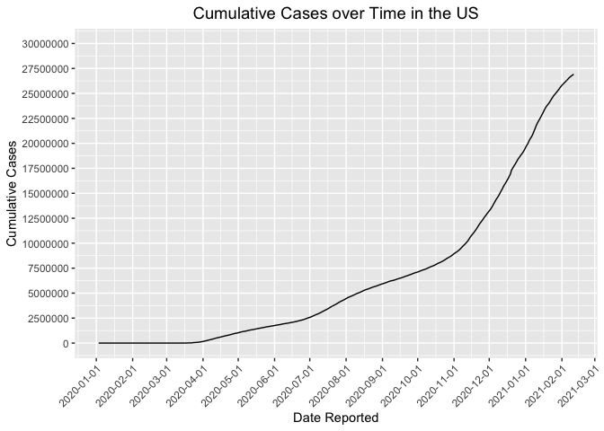
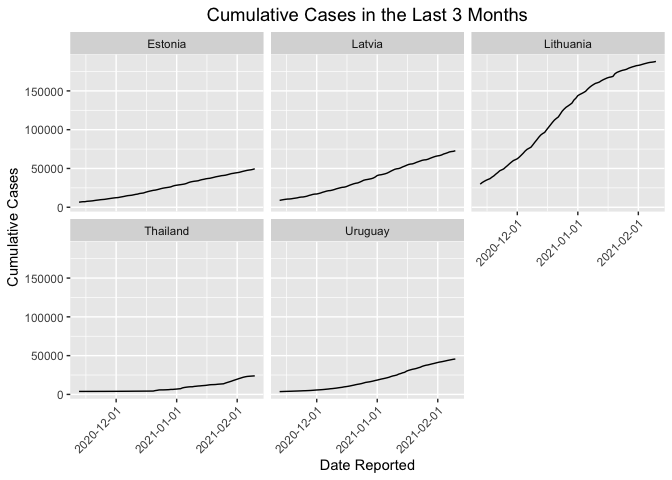
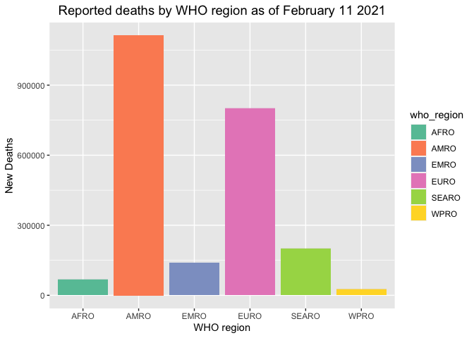

These are the steps we took to analyze our data.  


----
## **Load the libraries**


```r
library(tidyverse)
```

```
## ── Attaching packages ─────────────────────────────────────── tidyverse 1.3.0 ──
```

```
## ✓ ggplot2 3.3.3     ✓ purrr   0.3.4
## ✓ tibble  3.1.0     ✓ dplyr   1.0.4
## ✓ tidyr   1.1.2     ✓ stringr 1.4.0
## ✓ readr   1.4.0     ✓ forcats 0.5.1
```

```
## ── Conflicts ────────────────────────────────────────── tidyverse_conflicts() ──
## x dplyr::filter() masks stats::filter()
## x dplyr::lag()    masks stats::lag()
```

```r
library(janitor)
```

```
## 
## Attaching package: 'janitor'
```

```
## The following objects are masked from 'package:stats':
## 
##     chisq.test, fisher.test
```

```r
library(here)
```

```
## here() starts at /Users/srinidhi/Desktop/rmarkdown-website-tutorial
```

```r
library(naniar)
library(skimr)
```

```
## 
## Attaching package: 'skimr'
```

```
## The following object is masked from 'package:naniar':
## 
##     n_complete
```

<br>
<br>

## **Cleaning Up the Data**

### Load the data frame


```r
covid <- readr::read_csv("data/WHO-COVID-19-global-data.csv")
```

```
## 
## ── Column specification ────────────────────────────────────────────────────────
## cols(
##   Date_reported = col_character(),
##   Country_code = col_character(),
##   Country = col_character(),
##   WHO_region = col_character(),
##   New_cases = col_double(),
##   Cumulative_cases = col_double(),
##   New_deaths = col_double(),
##   Cumulative_deaths = col_double()
## )
```


### Clean the data up

```r
covid<-janitor::clean_names(covid)
```


```r
covid$date_reported <- lubridate::mdy(covid$date_reported)
```


```r
covid$date_reported <- as.Date(covid$date_reported)
covid$cumulative_cases <- as.numeric(as.character(covid$cumulative_cases))
```

<br>
<br>

## **Preliminary analysis**

```r
skim(covid)
```


Table: Data summary

|                         |      |
|:------------------------|:-----|
|Name                     |covid |
|Number of rows           |96222 |
|Number of columns        |8     |
|_______________________  |      |
|Column type frequency:   |      |
|character                |3     |
|Date                     |1     |
|numeric                  |4     |
|________________________ |      |
|Group variables          |None  |


**Variable type: character**

|skim_variable | n_missing| complete_rate| min| max| empty| n_unique| whitespace|
|:-------------|---------:|-------------:|---:|---:|-----:|--------:|----------:|
|country_code  |       812|          0.99|   2|   2|     0|      235|          0|
|country       |         0|          1.00|   4|  56|     0|      237|          0|
|who_region    |         0|          1.00|   4|   5|     0|        7|          0|


**Variable type: Date**

|skim_variable | n_missing| complete_rate|min        |max        |median     | n_unique|
|:-------------|---------:|-------------:|:----------|:----------|:----------|--------:|
|date_reported |         0|             1|2020-01-03 |2021-02-11 |2020-07-23 |      406|


**Variable type: numeric**

|skim_variable     | n_missing| complete_rate|      mean|        sd|     p0| p25| p50|      p75|     p100|hist  |
|:-----------------|---------:|-------------:|---------:|---------:|------:|---:|---:|--------:|--------:|:-----|
|new_cases         |         0|             1|   1111.92|   7525.43| -32952|   0|   3|   172.00|   402270|▇▁▁▁▁ |
|cumulative_cases  |         0|             1| 120688.43| 827691.39|      0|   5| 864| 16985.75| 26923756|▇▁▁▁▁ |
|new_deaths        |         0|             1|     24.39|    140.32|   -514|   0|   0|     3.00|     6409|▇▁▁▁▁ |
|cumulative_deaths |         0|             1|   3202.05|  17806.41|      0|   0|  14|   316.75|   464412|▇▁▁▁▁ |
<font size="3" color="lightblue4">The NA's in this data are represented by "NA" and "######"</font>

<br>
<br>

## **Cumulative Cases**
### Which countries had the most cumulative cases?
<font size="3" color="blue">This shows the data from the most recent data collection date: 02-11-2021..</font>

```r
covid %>% 
  filter(date_reported == "2021-02-11") %>% 
  arrange(desc(cumulative_cases))
```

```
## # A tibble: 237 x 8
##    date_reported country_code country      who_region new_cases cumulative_cases
##    <date>        <chr>        <chr>        <chr>          <dbl>            <dbl>
##  1 2021-02-11    US           United Stat… AMRO           90930         26923756
##  2 2021-02-11    IN           India        SEARO          12923         10871294
##  3 2021-02-11    BR           Brazil       AMRO           51486          9599565
##  4 2021-02-11    RU           Russian Fed… EURO           15038          4027748
##  5 2021-02-11    GB           The United … EURO           13013          3985165
##  6 2021-02-11    FR           France       EURO           24631          3328987
##  7 2021-02-11    ES           Spain        EURO            8298          3023601
##  8 2021-02-11    IT           Italy        EURO           12947          2668266
##  9 2021-02-11    TR           Turkey       EURO            8642          2556837
## 10 2021-02-11    DE           Germany      EURO           10237          2310233
## # … with 227 more rows, and 2 more variables: new_deaths <dbl>,
## #   cumulative_deaths <dbl>
```
<font size="3" color="blue">The countries that have the most cumulative cases in the world are: the United States, India, Brazil, the Russian Federation, and the United Kingdom.</font>


<br>
<br>


### Cumulative cases in US over time

```r
covid%>%
  filter(country_code == "US")%>%
  ggplot(aes(x = date_reported, y = cumulative_cases))+
  geom_line(aes(group = 1))+
  scale_x_date(date_labels = "%Y-%m-%d")+
  scale_x_date(date_breaks = "1 month")+
  scale_y_continuous(breaks = seq(0, 30000000, by = 2500000), limits=c(0, 30000000))+
  theme(axis.text.x=element_text(angle=45, hjust=1)) +
  scale_color_brewer(palette = "Set2")+
  labs(title="Cumulative Cases over Time in the US", x="Date Reported", y="Cumulative Cases")+
  theme(plot.title = element_text(size = rel(1.26), hjust = 0.5))
```

```
## Scale for 'x' is already present. Adding another scale for 'x', which will
## replace the existing scale.
```

<!-- -->

<font size="3" color="blue">The United States had the most cumulative cases, so we decided to plot the number of cases in the US from the beginning of the data collection (01-01-2020) to the most recent data we have (02-11-2021).</font>

<br>
<br>

### Cumulative cases in the world over time

```r
covid%>%
  group_by(country)%>%
  filter(country_code == "US"| country_code == "IN"| country_code == "BR"| country_code == "RU"| country_code == "GB")%>%
  ggplot(aes(x = date_reported, y = cumulative_cases, group = country, color = country))+
  geom_line()+
  scale_x_date(date_labels = "%Y-%m-%d")+
  scale_x_date(date_breaks = "1 month")+
  scale_y_continuous(breaks = seq(0, 30000000, by = 2500000), limits=c(0, 30000000))+
  theme(axis.text.x=element_text(angle=45, hjust=1)) +
  scale_color_brewer(palette = "Set2")+
  labs(title="Cumulative Cases over Time", x="Date Reported", y="Cumulative Cases")+
  theme(plot.title = element_text(size = rel(1.26), hjust = 0.5))
```

```
## Scale for 'x' is already present. Adding another scale for 'x', which will
## replace the existing scale.
```

<!-- -->

<font size="3" color="blue">This plot shows us how the cumulative cases have increased for the top 5 countries with the most cumulative cases.</font>

<br>
<br>

### Which country's cumulative cases are growing the fastest?

<font size="3" color="blue">We did this by subtracting the amount of cases on 11-11-2020 from the amount of cases on 2-11-2021. This data is for the last 3 months.</font>

```r
covid%>%
  group_by(country)%>%
  filter(cumulative_cases > 1000)%>%
  filter(date_reported == "2020-11-11" | date_reported == "2021-2-11")%>%
  arrange(date_reported)%>%
  mutate(inc_rate =(cumulative_cases - lag(cumulative_cases)) / lag(cumulative_cases))%>%
  arrange(desc(inc_rate))
```

```
## # A tibble: 356 x 9
## # Groups:   country [186]
##    date_reported country_code country   who_region new_cases cumulative_cases
##    <date>        <chr>        <chr>     <chr>          <dbl>            <dbl>
##  1 2021-02-11    UY           Uruguay   AMRO             503            46153
##  2 2021-02-11    LV           Latvia    EURO             990            73859
##  3 2021-02-11    EE           Estonia   EURO             675            50280
##  4 2021-02-11    LT           Lithuania EURO            1067           189058
##  5 2021-02-11    TH           Thailand  SEARO            201            24104
##  6 2021-02-11    RS           Serbia    EURO            2088           413943
##  7 2021-02-11    MY           Malaysia  WPRO            3288           251604
##  8 2021-02-11    CY           Cyprus    EURO             113            32072
##  9 2021-02-11    LS           Lesotho   AFRO              86             9804
## 10 2021-02-11    LK           Sri Lanka SEARO            963            72174
## # … with 346 more rows, and 3 more variables: new_deaths <dbl>,
## #   cumulative_deaths <dbl>, inc_rate <dbl>
```

<font size="3" color="blue">In the last 3 months, the countries with the fastest growth of cumulative cases are: Uruguay, Latvia, Estonia, Lithuania, and Thailand.</font>

<br>
<br>

### Comparing the cumulative cases through faceting

```r
covid2 <- covid%>%
  filter(country == "Uruguay"| country == "Latvia" | country == "Estonia" | country == "Lithuania" | country == "Thailand")%>%
  filter(date_reported > "2020-11-11" , date_reported < "2021-2-11")%>%
  ggplot(aes(x = date_reported, y = cumulative_cases))+
  geom_line()+
  scale_x_date(date_labels = "%Y-%m-%d")+
  theme(axis.text.x=element_text(angle=45, hjust=1))+
  scale_fill_brewer(palette = "Set2")+
  labs(title = "Cumulative Cases in the Last 3 Months", x = "Date Reported", y = "Cumulative Cases")+
  theme(plot.title = element_text(size = rel(1.26), hjust = 0.5))
```

```r
covid2 + facet_wrap(~country)
```

<!-- -->

<font size="3" color="blue">This plot shows us how the cumulative cases have increased for the countries that have increased in cumulative cases the fastest. We analyzed the last 3 months.</font>

<br>
<br>

## **Cumulative Deaths**
### Which countries had the most deaths?

```r
covid %>% 
  filter(date_reported== "2021-02-11") %>% 
  arrange(desc(cumulative_deaths))
```

```
## # A tibble: 237 x 8
##    date_reported country_code country      who_region new_cases cumulative_cases
##    <date>        <chr>        <chr>        <chr>          <dbl>            <dbl>
##  1 2021-02-11    US           United Stat… AMRO           90930         26923756
##  2 2021-02-11    BR           Brazil       AMRO           51486          9599565
##  3 2021-02-11    MX           Mexico       AMRO           10738          1946751
##  4 2021-02-11    IN           India        SEARO          12923         10871294
##  5 2021-02-11    GB           The United … EURO           13013          3985165
##  6 2021-02-11    IT           Italy        EURO           12947          2668266
##  7 2021-02-11    FR           France       EURO           24631          3328987
##  8 2021-02-11    RU           Russian Fed… EURO           15038          4027748
##  9 2021-02-11    ES           Spain        EURO            8298          3023601
## 10 2021-02-11    DE           Germany      EURO           10237          2310233
## # … with 227 more rows, and 2 more variables: new_deaths <dbl>,
## #   cumulative_deaths <dbl>
```
<font size="3" color="blue">The countries with the highest cumulative deaths are: the United States, Brazil, Mexico, India, and the United Kingdom.</font>

<br>
<br>

### Cumulative deaths over time

```r
covid%>%
  group_by(country)%>%
  filter(country_code == "US"| country_code == "BR"| country_code == "MX"| country_code == "IN"| country_code == "GB")%>%
  ggplot(aes(x = date_reported, y = cumulative_deaths, group = country, color = country))+
  geom_line()+
  scale_x_date(date_labels = "%Y-%m-%d")+
  scale_x_date(date_breaks = "1 month")+
  scale_y_continuous(breaks = seq(0, 300000, by = 25000), limits=c(0, 300000))+
  theme(axis.text.x=element_text(angle=45, hjust=1))+
   scale_color_brewer(palette = "Set2")+
  labs(title="Cumulative Deaths over Time", x="Date Reported", y="Cumulative Deaths")+
  theme(plot.title = element_text(size = rel(1.26), hjust = 0.5))
```

```
## Scale for 'x' is already present. Adding another scale for 'x', which will
## replace the existing scale.
```

```
## Warning: Removed 57 row(s) containing missing values (geom_path).
```

<!-- -->

<br>
<br>

## **New Cases**
### Countries with the highest amount of new cases
<font size="3" color="blue">This is data that was reported on 02-11-2021.</font> 

```r
covid%>%
  select(date_reported, country, new_cases)%>%
  filter(date_reported=="2021-02-11")%>%
arrange(desc(new_cases))
```

```
## # A tibble: 237 x 3
##    date_reported country                  new_cases
##    <date>        <chr>                        <dbl>
##  1 2021-02-11    United States of America     90930
##  2 2021-02-11    Brazil                       51486
##  3 2021-02-11    France                       24631
##  4 2021-02-11    Russian Federation           15038
##  5 2021-02-11    The United Kingdom           13013
##  6 2021-02-11    Italy                        12947
##  7 2021-02-11    India                        12923
##  8 2021-02-11    Mexico                       10738
##  9 2021-02-11    Germany                      10237
## 10 2021-02-11    Czechia                       9537
## # … with 227 more rows
```
<font size="3" color="blue">The top 5 countries are : the United States, Brazil, France, the Russian Federation, and the United Kingdom.</font> 

<br>
<br>

### How New Cases on 02-11-2021 Compare in the Top 5 Countries

```r
covid%>%
  filter(country=="United States of America"| country=="Brazil"| country=="Russian Federation" |country=="The United Kingdom"| country=="France")%>%
  filter(date_reported=="2021-02-11")%>%
  ggplot(aes(x=date_reported, y=new_cases, group=country, fill=country))+
  geom_col(position="dodge")+scale_fill_brewer(palette = "Set2")+
  labs(title = "Countries with highest reported new cases",
       x="Date",
       y="New Cases")+
  theme(plot.title = element_text(size = rel(1.26), hjust = 0.5))
```

<!-- -->

<font size="3" color="blue">This plot shows the number of new cases reported on February 11, 2021 across the countries that reported the most cases.</font> 

<br>
<br>

### Comparing New Cases in different WHO regions
<font size="3" color="blue">TThe WHO divides the world into 6 regions: African Region (AFRO), Region of the Americas (AMRO), South-East Asian Region (SEAR), the European Region (EURO), the Eastern Mediterranean Region (EMRO), and the Western Pacific Region (WPRO).</font>


```r
options(scipen=999) 
covid%>%
  group_by(who_region)%>%
  filter(who_region!="Other")%>%
  select(date_reported, new_cases, who_region)%>%
  ggplot(aes(x=who_region, y=new_cases, fill=who_region))+
  geom_col()+scale_fill_brewer(palette = "Set2")+
  labs(title = "Reported cases by WHO region as of 2/11/2021 ",
       x="WHO Region",
       y="New Cases")+
  theme(plot.title = element_text(size = rel(1.26), hjust = 0.5))
```

<!-- -->

<br>
<br>

### Countries with the highest amount of new deaths


```r
covid%>%
  select(date_reported, country, new_deaths)%>%
  filter(date_reported=="2021-02-11")%>%
arrange(desc(new_deaths))
```

```
## # A tibble: 237 x 3
##    date_reported country                  new_deaths
##    <date>        <chr>                         <dbl>
##  1 2021-02-11    United States of America       2802
##  2 2021-02-11    Mexico                         1701
##  3 2021-02-11    Brazil                         1350
##  4 2021-02-11    The United Kingdom             1001
##  5 2021-02-11    Germany                         666
##  6 2021-02-11    Russian Federation              553
##  7 2021-02-11    Poland                          456
##  8 2021-02-11    Italy                           336
##  9 2021-02-11    France                          295
## 10 2021-02-11    South Africa                    276
## # … with 227 more rows
```

<font size="3" color="blue">The top 5 countries are : the United States, Mexico, Brazil, the United Kingdom, and Germany.</font> 

<br>
<br>

## **New Deaths**
### How New Deaths on 02-11-2021 Compare in the Top 5 Countries


```r
options(scipen=999) 
covid%>%
  filter(country=="United States of America"| country=="Mexico"| country=="Brazil" |country=="The United Kingdom"| country=="Germany")%>%
  filter(date_reported=="2021-02-11")%>%
  ggplot(aes(x=date_reported, y=new_deaths, group=country, fill=country))+
  geom_col(position="dodge")+scale_fill_brewer(palette = "Set2")+
  labs(title = "Countries with highest reported new deaths",
       x="Date",
       y="New Deaths")+
  theme(plot.title = element_text(size = rel(1.26), hjust = 0.5))
```

<!-- -->

<font size="3" color="blue">This plot shows the number of new deaths reported on February 11, 2021 across the countries that reported the most deaths</font> 

<br>
<br>

### Comparing New Deaths by different WHO regions


```r
options(scipen=999) 
covid%>%
  group_by(who_region)%>%
  filter(who_region!="Other")%>%
  select(date_reported, new_deaths, who_region)%>%
  ggplot(aes(x=who_region, y=new_deaths, fill=who_region))+
  geom_col()+scale_fill_brewer(palette = "Set2")+
  labs(title = "Reported deaths by WHO region as of February 11 2021",
       x="WHO region",
       y="New Deaths")+
  theme(plot.title = element_text(size = rel(1.26), hjust = 0.5))
```

<!-- -->


<br>
<br>
<br>
[Go Home](https://v-srinidhi.github.io/group8-finalproject/)
